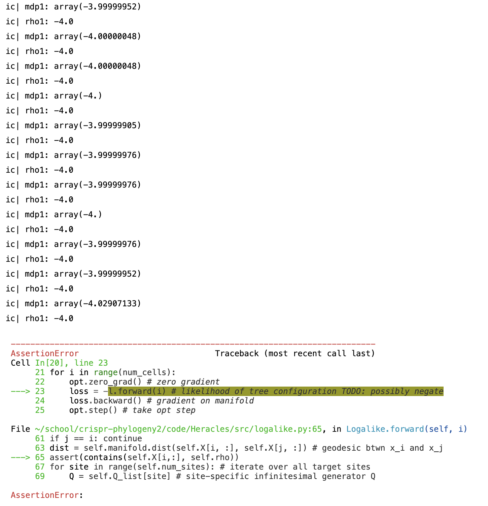

# April 25th, 2023
(25/04/2023)

## To-Do :brain: :
- Implement Felsteinstein's algorithm to estimate $\pi$ accurately
- Implement efficent :gear: matrix exponentiation operation $P = \textrm{expm}(Q)$

- Evaluate model performance via (1) :white_check_mark: distance matrix correlation, (2) :white_check_mark: triplets correct (tree comparison), and (3) :x: robinson-fould's distance (tree comparison).
  - Create util function that creates an estimated tree from a dist matrix with neighbor joining, UPGMA, BIONJ, and Weighbor, etc. This estimated tree is necessary for Robinson Fould metric.
- Install `gurobi` optimization software -- but need to request an appropriate (academic) license :cry:
- Transfer code to run on GPU and on lab's compute cluster :floppy_disk: :zap:
- 

  
 Long Term 

  - Add feature to `geoopt` to fix inappropriate behavior of `arcosh` function and `arcsinh` function 
  - Add feature to `geoopt` to maximize optimizers instead of just minimizing them
  - Alternatively add option to pass `**kwargs` into optimizers from `geoopt`'s optimizer class into `PyTorch`'s optimizer class
  - :rotating_light: I have a character matrix `cm` and turn it into a pairwise distance matrix `pdm` with ancestry-aware hamming distance. However, why do I estimate a tree from `pdm` and *only then* embedd my points in hyperbolic space? **Does it make more sense to embedd my pairwise distance matrix `pdm` into hyperbolic space directly?**
  - :rotating_light: **Should I add blank cell casette `[0 ... 0]` for root node?** I could add an auxilarly loss function that ensures that this root node is far away (perhaps equi-distantly far away) from all other leaf nodes.
    - This takes advantage of CRISPR specific modelling as we have acess to leaf cells but *also* know that there exists a cell with a blank, empty casette.

## Done :white_check_mark: :

## Notes :pencil: :

## Questions :question: :

# April 17th, 2023
(17/04/2023)

## Meeting :handshake: :
- Confirmed that triplets correct is implemented correctly!
- :star: Modify triplets correct function by replacing `critique_utilities.get_outgroup()` function with code that determines from my hyperbolic embeddings, which leaf node is the "outgroup" node.

# April 16th, 2023
(16/04/2023)

## To-Do :brain: :
- Implement Felsteinstein's algorithm to estimate $\pi$ accurately
- Implement efficent :gear: matrix exponentiation operation $P = \textrm{expm}(Q)$
- Add feature to `geoopt` to maximize optimizers instead of just minimizing them
  - Alternatively add option to pass `**kwargs` into optimizers from `geoopt`'s optimizer class into `PyTorch`'s optimizer class
- Evaluate model performance via (1) :white_check_mark: distance matrix correlation, (2) :white_check_mark: triplets correct (tree comparison), and (3) :x: robinson-fould's distance (tree comparison).
  - Create util function that creates an estimated tree from a dist matrix with neighbor joining, UPGMA, BIONJ, and Weighbor, etc. This estimated tree is necessary for Robinson Fould metric.
- :rotating_light: I have a character matrix `cm` and turn it into a pairwise distance matrix `pdm` with ancestry-aware hamming distance. However, why do I estimate a tree from `pdm` and *only then* embedd my points in hyperbolic space? **Does it make more sense to embedd my pairwise distance matrix `pdm` into hyperbolic space directly?**
- :rotating_light: **Should I add blank cell casette `[0 ... 0]` for root node?** I could add an auxilarly loss function that ensures that this root node is far away (perhaps equi-distantly far away) from all other leaf nodes.
  - This takes advantage of CRISPR specific modelling as we have acess to leaf cells but *also* know that there exists a cell with a blank, empty casette.
- Install `gurobi` optimization software -- but need to request an appropriate (academic) license :cry:

## Done :white_check_mark: :
  - Clean up code, incorprating `MLflow` better and watching video tutorials on it. I also made a new file for my metrics, `metrics2.py` because the first is very messy -- it will need to be deleted.
  - Have fully implemented 2 out of 3 ways of measuring performance of my model. Correlation of distance matricies and triplets_correct have been implemented. Robinson-Fould's has not yet been *cleanly* implemented -- to do so I need to write some `util` functions that create a tree from a distance matrix in a large variety of ways e.g. UPGMA, NJ, Weighbor, BioNJ, etc.

## Notes :pencil: :
- Finally, I can start evaluating my models, at least somewhat. Frustratingly, although the loss is monotonically decreasing (or at least appears to be monotonically decreasing), my `dist_correlation` and `triplets_correct` don't perform as well. Sometimes these metrics decrease instead of increase. Sometimes when they do increase, they do not increase that much over the initial baseline -- and this increase does not appear to be monotonic.
- I still get `assert` errors when initally embedding my points on the hyperboloid -- this gets worse in higher embedding dimensions.
- Beginning to think about how I want to compare my model results to the `Cassiopeia` package. Maybe ask author for scripts + setitngs used to evaluate their models? I would *love* to get my hands on the code used to generate Figure 1 in the `Cassiopeia` paper -- I would use this code to similarly benchmark my model!
- :star: :star: The person who made `Cassiopeia` is at Weitzman. Maybe work with him? 

# April 14th, 2023
(14/04/2023)

## To-Do :brain: :
- Implement Felsteinstein's algorithm to estimate $\pi$ accurately
- Implement efficent :gear: matrix exponentiation operation $P = \textrm{expm}(Q)$
- Add feature to `geoopt` to maximize optimizers instead of just minimizing them
  - Alternatively add option to pass `**kwargs` into optimizers from `geoopt`'s optimizer class into `PyTorch`'s optimizer class
- Evaluate model performance via (1) distance matrix correlation, (2) triplets correct (tree comparison), and (3) robinson-fould's distance (tree comparison).
- Create util function that creates an estimated tree from a dist matrix with neighbor joining, UPGMA, BIONJ, and Weighbor, etc.
  - To create these estimated trees, using Cassieopia and also implement a function that returns the distance between two different casettes s1, s2. In hyperbolic setting do so by returning the geodesic between our learned embeddings

## Done :white_check_mark: :
  - Began working on implementing the other tree comparison methods e.g. Robinson-Foulds and Triplets correct

# April 10th, 2023
(09/04/2023)

## Meeting :handshake: :
- Told Sitara how I set up `mlflow` and began implementing the distance matrix comparison
- Sitara recommended I examine correlation between the true distance matrix and my estimated matrix instead of subtraction, division, etc.
  - Note that the method I need to compare the `true_dist` matrix and the `est_dist` matrix needs to be scale invariant!
- Sitara then walked me through her SEACells paper and gave me some general advice. Chilled with Phillip too.

## To-Do :brain: :
- :rotating_light: reorganize helper/utility functions and add docstrings to them
- Implement Felsteinstein's algorithm to estimate $\pi$ accurately
- Implement efficent :gear: matrix exponentiation operation $P = \textrm{expm}(Q)$
- Add feature to `geoopt` to maximize optimizers instead of just minimizing them
  - Alternatively add option to pass `**kwargs` into optimizers from `geoopt`'s optimizer class into `PyTorch`'s optimizer class
- :rotating_light: :rotating_light: Evaluate model performance via (1) distance matrix comparison, (2) triplets correct (tree comparison), and (3) robinson-fould's distance (tree comparison).
  - Use hyperbolic embeddings `X` to generate `est_dist` matrix which is fed into `Weighbor` to reconstruct a phylogenetic tree `est_tree`. Finally, I can use this `est_tree` to compute triplets_correct and Robinson-Fould's metrics.

## Done :white_check_mark: :
- Evaluate model performance with the following metrics: (triplets-correct + Robinson-Fould still need to be implemented)
  - **distance matrix comparison**: compute the correlation between `true_dist` matrix to the `est_dist` matrix. The `true_dist` matrix is computed by taking the `true_tree` and computing the pairwise distances between all leaves. The `est_dist` matrix is computed by taking the hyperbolic embeddings `l.X`, adding in duplicates that I removed, and computing their (hyperbolic) pairwise geodesics. I then compute the correlation between these distance matricies. 
- Combine Wilson hyperboloid definition of $<x,x> = - \rho^2$ with `geoopt` hyperboloid definition of $<x,x> = - \rho$. See notes below :point_down: for more details.

## Notes :pencil: :
- :rotating_light: When evaluating my model performance, I am using a variety of methods to compare the `true_tree` (in some form) to my learned hyperoblic embeddings `X` (which may be used to reconstruct a tree, dist matrix, etc). However, when creating the hyperbolic embeddings `X`, I remove duplicates. Thus the number of leaf cells in the `true_tree` is higher than in my hyperbolic embeddings `X`. To remedy this, I keep track of the number of duplicates I remove. Then, I repeat the specific embedding `X[i,:]` the correct number of times. This ensures that the `true_tree` and the hyperbolic embeddings `X` thus have the same number of cells being compared!
- `wilson` and `geoopt` have different conventions for defining the hyperbolid in terms of the (negative) curvature. In `wilson`, we define $<x,x> = - \gamma^2$ while in `geoopt` we define $<x,x> = - \rho$. Thus $\gamma^2 = \rho$. If we want to generally specify curvatre in terms of `geoopt` (b/c that's primarily what we are working with), then any time we use `wilson`, we must write $\gamma = \sqrt{\rho}$.

# April 3rd, 2023
(03/04/2023)

## Meeting :handshake: :
- Try to extract true tree distances from `Caissopia`. If not, create a `networkx` object.
- Mostly focus on comparing distance matricies and not trees. Also compare triplets correct.
- Can also construct trees with either `Weighbor` or `neighborjoining` or `upgma` and then compare on Robinson-Fould's distance. Do so using `Dendropy` / `Cassiopia`. Weighbor can be found [here](bio.tools/weighbor).

## To-Do :brain: :
- :rotating_light: reorganize helper/utility functions and add docstrings to them
- Combine Wilson hyperboloid definition of $<x,x> = - \rho^2$ with `geoopt` hyperboloid definition of $<x,x> = - \rho$.
- Implement Felsteinstein's algorithm to estimate $\pi$ accurately
- Implement efficent :gear: matrix exponentiation operation $P = \textrm{expm}(Q)$
- Add feature to `geoopt` to maximize optimizers instead of just minimizing them
  - Alternatively add option to pass `**kwargs` into optimizers from `geoopt`'s optimizer class into `PyTorch`'s optimizer class
- :star: Evaluate model performance via (1) distance matrix comparison or (2) tree comparison. Abstract details discussed in notes.

## Done :white_check_mark: :

## Notes :pencil: :
- :star: How to evaluate results?
  1. Can **compare the true phylogenetic tree with an estimated phylogenetic tree** (created from the distance between optimized hyperbolic embeddings with nearest neighbor joining / UPGMA). However, the process of creating the estimated phylogenetic tree is not 100% accurate
  2. Can **compare the original distance matrix** (created with ancestry-aware Hamming distance of character matrix entries) **to estimated distance matrix** (created from the distance between optimized hyperbolic embeddings). However, created the original distance matrix is not 100% accurate b/c ancestry-aware Hamming distance compresses much information; the estimated distance matrix is completely accurate with respect to the optimized hyperbolic embeddings.
      - In current implementation, my original distance matrix is computed with the ancestry-aware Hamming distance between casettes of leaf nodes. **This is incorrect** b/c much information is lost using the ancestry-aware Hamming distance function. Instead, I should examine the pairwise distance leaf nodes in the true graph.
      - When I compare my estimated distance matrix (from optimized hyperbolic embeddings) to the true distance matrix (specified above) I need to do so in a scale invariant way. This can be done by normalizing (perhaps across rows or columns?) or by element-wise division.
- Found that **Cassioepia computes likelihood** for continous time Markov chain [here](https://cassiopeia-lineage.readthedocs.io/en/latest/api/reference/cassiopeia.tl.calculate_likelihood_continuous.html).

# April 2nd, 2023
(02/04/2023)

## To-Do :brain: :
- Combine Wilson hyperboloid definition of $<x,x> = - \rho^2$ with `geoopt` hyperboloid definition of $<x,x> = - \rho$.
- Implement Felsteinstein's algorithm to estimate $\pi$ accurately
- Implement efficent matrix exponentiation operation $P = \textrm{expm}(Q)$

## Done :white_check_mark: :
- Posted issue on `geoopt` Github page asking where they square the gradient when implementing Riemannian Adam on lines 92-94 of `radam.py`.
- Created `geoopt` pull request to properly validate input to `arcosh()` function. The mathematical function for arc hyperbolic cosine is only valid on the domain $[1, \infty)$. Before, they incorrectly clamped their input $x$ and now I fixed it.
- Switched :arrows_counterclockwise: from Riemmannian Adam to Riemannian SGD b/c of possible error in Riemmanian Adam implementation. Also set `stablize` flag to ensure datapoint is on the hyperboloid.

## Notes :pencil: :
- Discovered that Wilson defines hyperboloid with $<x, x> = - \rho^2$ but `geoopt` defines hyperboloid with $<x,x> = - \rho$. This caused assertion statements to fail.
- Found how/where `geoopt` implements the $4$ steps of Riemmanian optimization as per my notes on March 30th, 2023. 
  - Gradient $h := \nabla_\theta \mathcal{L}(\theta^t) = g^{-1}_{\theta^t} \frac{\partial \mathcal{L}(\theta^t)} {\partial \theta}$ uses `PyTorch`-computed derivatives $\frac{\partial \mathcal{L}(\theta^t)} {\partial \theta}$, and multiplies by the inverse metric tensor $g_{\theta^t}^{-1}$ in 1st line of `_egradtorgrad()` in Lorentz manifold's `math.py` file.

    

      
 Mathematical details 

      The inverse metric tensor is defined for the sign convention $(-, +, \ldots, +)$ as
    
      $g_{\theta^t}^{-1} = \begin{bmatrix} -1 &  &  & & \\ & 1 & & & \\ & & \ddots & & \\ & & & 1 & \\ & & & & 1 \end{bmatrix}$

      Thus multiplication by $g_{\theta^t}^{-1}$ is trivially implemented by multiplying the first element of $\theta$ by $-1$ (in my notation, I take the last dimension of $X$ and multiply its first element by $-1$).
    

  - Project gradient $h$ onto tangent space $\mathcal{T}_{\theta^t}\mathcal{M}$ to get vector $v$ in 2nd line of `_egradtorgrad()` in Lorentz manifold's `math.py` file.

  - Perform optimizer update trivially with $- \eta v$ for Riemmanian SGD in `rsgd.py` file: `manifold.retr(point, -learning_rate * grad)`

  - Project back onto manifold via exponential map in `rsgd.py` file: `manifold.retr(point, -learning_rate * grad)`. Note that in `__init__.py` file of Lorentz manifold, this retraction method is set to the exponential map.

## :rotating_light: :rotating_light: Pull Request:

### Intro

This pull requests attempts to fix two (possible) issues in the `math.py` file for the Lorentz manifold. I first fix how the `_project()` function projects a vector onto the hyperboloid surface. I also fix how `arcosh()` function clamps the input x into a valid domain.

I belive there is a mistake in the math behind the projection, though it is certainly possible I am mistaken. This is also my first pull request so please let me know if I'm missing something or if I can improve it!

### Background / Motivation

Consider an arbitrary point $\mathbf{x} \in \mathcal{H}$ on hyperboloid with curvature $k$ with dimensionality $d+1$ such that its elements are $x_0, x_1 \ldots x_d$. This point must satisfy $<\mathbf{x},\mathbf{x}> = - k^2$, where the Minkowski dot product is defined as $<\mathbf{x},\mathbf{y}> = - x_0 y_0 + \Sigma_{i=1}^d x_i y_i$.

Previously, the `_project()` function implemented the following equation:  $\Pi_{R^{d+1} \rightarrow \mathbb{H}^{d, 1}} (\mathbf{x}):= \left( \sqrt{k + \left| \mathbf{x}_{1:d} \right|_2^2}, \mathbf{x} _{1:d} \right)$.

However, when we apply the condition above, we see this projection is incorrect. Let $x$ be a data point and $z = \Pi(x)$ be the projection such that:

$<\mathbf{z}, \mathbf{z}> = \left< \left( \sqrt{k + \left| \mathbf{x} _{1:d} \right|_2^2}, \mathbf{x} _{1:d} \right), \left( \sqrt{k + \left| \mathbf{x} _{1:d} \right|_2^2}, \mathbf{x} _{1:d} \right) \right>$

Now simply this expression:

$<\mathbf{z}, \mathbf{z}> = - \left( \sqrt{k + \left| \mathbf{x} _{1:d} \right|_2^2}\right) \left( \sqrt{k + \left| \mathbf{x} _{1:d} \right|_2^2} \right)  + \left( \Sigma _{i=1}^d x_i \right) \left( \Sigma _{i=1}^d x_i \right) = - k - \left| \mathbf{x} _{1:d} \right|_2^2 +  \left| \mathbf{x} _{1:d} \right|_2^2 = -k \neq - k^2$

### Details of the Pull Request
To fix the above issue, I made this pull request that trivially redefines the projection by replacing $k$ with $k^2$:  $\Pi_{R^{d+1} \rightarrow \mathbb{H}^{d, 1}} (\mathbf{x}):= \left( \sqrt{k^2 + \left| \mathbf{x}_{1:d} \right|_2^2}, \mathbf{x} _{1:d} \right)$. This ensures that $<\mathbf{z},\mathbf{z}> = - k^2$.

I specifically made this change in the `_project()` function and in the doc string of the `project()` function. A similar change may need to be made for the polar coordinates projection `_project_polar()`, though I have not looked into the math.

# March 30th, 2023
(03/30/2023)

## To-Do: (things I need to change)
- :rotating_light: Getting `NaN` error when using Riemanian ADAM optimizer from `geoopt` -- however I suspect there may be a mistake in rADAM implementation. Therefore, I am temporarily switching to Riemanian SGD to see if that removes the error!
- Investigate if they forgot to square the gradient-norm in line $93$ of the `radam.py` file in `geoopt`.
- Investigate if the check that a point is containted on a manifold has bad value clipping such that it is possible to get a `NaN` error from the sqrt function

## Done: (things I've actually changed)
- In Riemannian SGD blog post (linked below) they give an example implementation with `geoopt`. They make a few addtions which I've added:
    - :rotating_light: Before passing in $X$ as a manifold parameter, they first make $X$ a manifold tensor.
    - They pass in a parameter to the Riemannian ADAM algorithm that *stablizes* it every $n$ iterations. They set $n=1$ and I do as well.
- Investigate why `Likelihood.parameters()` has two parameters to optimize: the hyperbolic embeddings $X$ and the manifold curvature parameter $\rho$. The *only* parameter should be $X$!
  - Lorentz manifold, by default, makes the curvature $\rho$ a Manifold parameter but sets `requires_grad=False`. I fixed this by directly passing in `[l.X]` -- a list of the hyperbolic embeddings $X$ -- to our optimizer

## Notes: (thoughts / conceptual understanding)
- Investigated blog post that explains **Riemanian SGD** really well [here](https://andbloch.github.io/Stochastic-Gradient-Descent-on-Riemannian-Manifolds/). They describe the algorithm as follows
    1. Compute gradient $h := \nabla_\theta \mathcal{L}(\theta^t) = g^{-1}_{\theta^t} \frac{\partial \mathcal{L}(\theta^t)} {\partial \theta}$ for loss function $\mathcal{L}$, normal auto-grad derivatives $\frac{\partial \mathcal{L}(\theta^t)} {\partial \theta}$, and the inverse metric tensor $g_{\theta^t}^{-1}$
    2. Project gradient $h$ onto tangent space $\mathcal{T}_{\theta^t}\mathcal{M}$ to get vector $v = \textrm{proj}_{\mathcal{T}_{\theta^t}\mathcal{M}} h$
    3. Perform optimizer update. With SGD, we compute $ -\eta v$ which still lies on the tangent plane $\mathcal{T}_{\theta^t}\mathcal{M}$. With ADAM, this update is different.
    4. Project back onto manifold $\mathcal{M}$ through exponential map or retraction:
        - $\theta^{t+1} = \textrm{exp}( -\eta v)$. Exponential map involves computing difficult-to-compute differential equation
        - $\theta^{t+1} = \textrm{proj}_{\mathcal{M}} (\theta^t - \eta v )$. Retraction is a first order approximation to the exponential map.

# March 3rd, 2023
(03/03/2023)

## To-Do:
- Check that the gradient provided by `geoopt` is the same gradient that I would get when manually computing it
- Switch away from using `geoopt` and instead manually write code in pytorch. Then compute the gradient, only using the Wilson convention.

## Done:
- Confirmed the proper hyperboloic notation (in terms of $+$ and $-$ signs for inner product definition)
- When checking that a point is on the hyperboloid, must check two requirements:
    - $<x,x> = - \rho^2$
    - $x[0] > 0$

  Note that the inner product $<\cdot, \cdot>$ and indexing the first element $x[0]$ are both assuming the geoopt convention for the hyperboloid model. I specifically added the second requirement to the `contains()` function when checking that a point lies in the `geoopt` hyperboloid model.

## Questions:

## Notes:
- Investigating why `geoopt`'s gradient updates slowly make points drift off the hyperboloid model. Two leading hypothesis:
    - Precision error
    - Implementation mistake

  Can see points drifting off hyperboloid: 

  One can observe that the negative curvature squared, $- \rho^2$ is equal to $-4$ as given by the variable `rho1`. The single data point, given by `mdp`, 'wobbles' around the value of $-4$ before drifting to far away and triggering an assertion error.